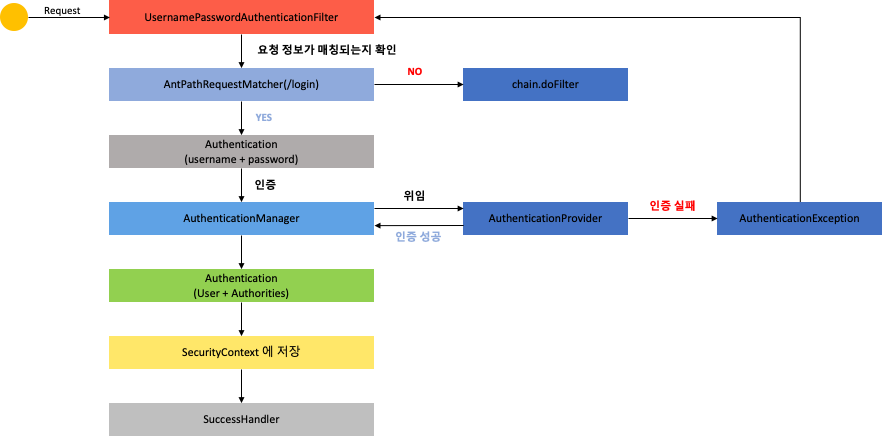
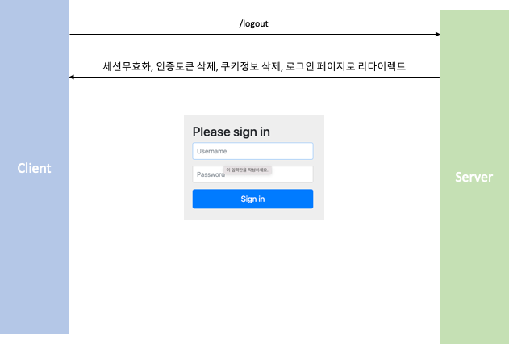
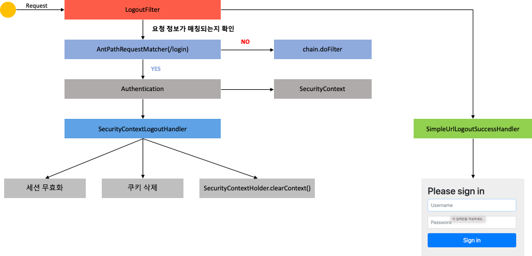

# Spring Security #1 - Spring Security 기본 API 및 Filter 이해 (2)

## 환경

- `java 11`
- `spring 2.7`
- `spring security 2.7`
- `spring data jpa 2.7`

## Form Login 인증 필터

### UsernamePasswordAuthenticationFilter



- 인증요청시 `UsernamePasswordAuthenticationFilter` 내부적으로 인증처리 진행
- `AntPathRequestMatcher(/login)` 에서 요청 정보의 URL 확인(default /login)
- 인증 요청 URL이 아니면 `chain.doFilter` 실행
- 인증 요청 URL이면 `Authentication` 객체를 생성하여 `username`과 `password`를 저장한 인증 객체를 생성
- `AuthenticationManager`에서 인증객체를 전달받아 인증을 진행하며, 내부적으로 `AuthenticationProvier` 객체들을 가지고 있어 해당 객체중 하나를 선택하여 인증 처리를 위임
- 인증 실패하면 `AuthenticationException` 발생하면 `UsernamePasswordAuthenticationFilter`로 돌아가 후속작업을 진행
- 인증 성공하면 `Authentication` 객체를 생성하여 `AuthenticationManager`로 반환
    - `User`객체 및 권한인 `Authorities`객체 정보를 생성
- 반환 된 `Authentication` 객체는 다시 `Filter`로 반환
- `SecurityContext`(인증 객체 저장소)에 `Authentication` 객체 저장
- `SuccessHandler`에서 인증 성공 후 처리 진행

## Logout



### Logout

```java

@Configuration
@EnableWebSecurity
public class SecurityConfig {
    @Bean
    public SecurityFilterChain filterChain(HttpSecurity http) throws Exception {

        ...

        http.logout()                   // 로그아웃 처리
                .logoutUrl("/logout")   // 로그아웃 처리 URL
                .logoutSuccessUrl("/login") // 로그아웃 성공 후 이동페이지
                .deleteCookies("JSESSIONID", "remember-me") // 쿠키 삭제
                .addLogoutHandler(new LogoutHandler() {
                    @Override
                    public void logout(HttpServletRequest request, HttpServletResponse response, Authentication authentication) {
                        // 원하는 작업을 별도로 구현시 사용
                        HttpSession session = request.getSession();
                        session.invalidate();
                    }
                }) // 로그아웃 핸들러
                .logoutSuccessHandler(new LogoutSuccessHandler() {
                    @Override
                    public void onLogoutSuccess(HttpServletRequest request, HttpServletResponse response, Authentication authentication) throws IOException, ServletException {
                        response.sendRedirect("/login");
                    }
                }).logoutSuccessHandler((HttpServletRequest request, HttpServletResponse response, Authentication authentication) -> {
                  // lambda 이용 
                });// 로그아웃 성공 후 핸들러

        return http.build();
    }

}

```

### LogoutFilter



- 요청이 들어오면 `LogoutFilter` 에 요청이 들어온다.(POST)
- `AntPathRequestMatcher(/logout)` 에서 logout 요청인지 판단한다.
  - 로그아웃 요청이 아니면 `chain.doFilter` 실행
- 로그아웃 요청이면 `Authentication`을 `SecurityContext`에서 가져온다 
- `SecurityContextLogoutHandler`에서 세션무효화, 쿠키삭제, `SecurityContextHolder`를 클리어 한다.
- 완료가 되면 `SimpleUrlLogoutSuccessHandler`에서 로그인 페이지로 이동