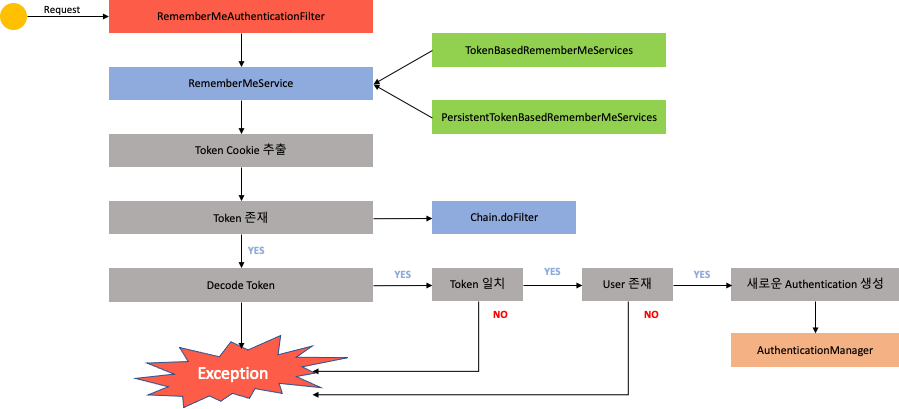
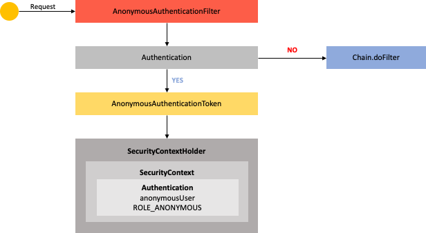

# Spring Security #1 - Spring Security 기본 API 및 Filter 이해 (2)

## 환경

- `java 11`
- `spring 2.7`
- `spring security 2.7`
- `spring data jpa 2.7`

## Form Login 인증 필터

### UsernamePasswordAuthenticationFilter


- 인증요청시 `UsernamePasswordAuthenticationFilter` 내부적으로 인증처리 진행
- `AntPathRequestMatcher(/login)` 에서 요청 정보의 URL 확인(default /login)
- 인증 요청 URL이 아니면 `chain.doFilter` 실행
- 인증 요청 URL이면 `Authentication` 객체를 생성하여 `username`과 `password`를 저장한 인증 객체를 생성
- `AuthenticationManager`에서 인증객체를 전달받아 인증을 진행하며, 내부적으로 `AuthenticationProvier` 객체들을 가지고 있어 해당 객체중 하나를 선택하여 인증 처리를 위임
- 인증 실패하면 `AuthenticationException` 발생하면 `UsernamePasswordAuthenticationFilter`로 돌아가 후속작업을 진행
- 인증 성공하면 `Authentication` 객체를 생성하여 `AuthenticationManager`로 반환
    - `User`객체 및 권한인 `Authorities`객체 정보를 생성
- 반환 된 `Authentication` 객체는 다시 `Filter`로 반환
- `SecurityContext`(인증 객체 저장소)에 `Authentication` 객체 저장
- `SuccessHandler`에서 인증 성공 후 처리 진행

## Logout


### Logout

```java

@Configuration
@EnableWebSecurity
public class SecurityConfig {
    @Bean
    public SecurityFilterChain filterChain(HttpSecurity http) throws Exception {

        ...

        http.logout()                   // 로그아웃 처리
                .logoutUrl("/logout")   // 로그아웃 처리 URL
                .logoutSuccessUrl("/login") // 로그아웃 성공 후 이동페이지
                .deleteCookies("JSESSIONID", "remember-me") // 쿠키 삭제
                .addLogoutHandler(new LogoutHandler() {
                    @Override
                    public void logout(HttpServletRequest request, HttpServletResponse response, Authentication authentication) {
                        // 원하는 작업을 별도로 구현시 사용
                        HttpSession session = request.getSession();
                        session.invalidate();
                    }
                }) // 로그아웃 핸들러
                .logoutSuccessHandler(new LogoutSuccessHandler() {
                    @Override
                    public void onLogoutSuccess(HttpServletRequest request, HttpServletResponse response, Authentication authentication) throws IOException, ServletException {
                        response.sendRedirect("/login");
                    }
                }).logoutSuccessHandler((HttpServletRequest request, HttpServletResponse response, Authentication authentication) -> {
                    // lambda 이용 
                });// 로그아웃 성공 후 핸들러

        return http.build();
    }

}

```

### LogoutFilter


- 요청이 들어오면 `LogoutFilter` 에 요청이 들어온다.(POST)
- `AntPathRequestMatcher(/logout)` 에서 logout 요청인지 판단한다.
    - 로그아웃 요청이 아니면 `chain.doFilter` 실행
- 로그아웃 요청이면 `Authentication`을 `SecurityContext`에서 가져온다
- `SecurityContextLogoutHandler`에서 세션무효화, 쿠키삭제, `SecurityContextHolder`를 클리어 한다.
- 완료가 되면 `SimpleUrlLogoutSuccessHandler`에서 로그인 페이지로 이동

## Remember Me 인증

- 세션이 만료되고 웹 브라우저가 종료된 후에도 어플리케이션이 사용자를 기억하는 기능
- `Remember-Me` 쿠키에 대한 Http 요청을 확인한 후 토큰 기반 인증을 사용해 유효성을 검사하고 토큰이 검증되면 사용자는 로그인
- 사용자 라이프 사이클
    - 인증성공(Remember-Me 쿠키 설정)
    - 인증실패(쿠키가 존재하면 쿠키 무효화)
    - 로그아웃(쿠키가 존재하면 쿠키 무요화)

```java

@Configuration
@EnableWebSecurity
public class SecurityConfig {
    @Bean
    public SecurityFilterChain filterChain(HttpSecurity http) throws Exception {

        ...

        http.rememberMe()
                .rememberMeParameter("remember") // 기본 파라미터 명은 remember-me (check box의 parameter)
                .tokenValiditySeconds(3600) // default 14
                .alwaysRemember(true) // remember me 기능이 활성화 되지 않아도 항상 실행
                .userDetailsService(userDetailService); // remember me 설정시 반드시 필요한 설정, 사용자 정보 가져오기 위한
        ...
    }
}
```

### RememberMeAuthenticationFilter



- `RememberMeAuthenticationFilter`는 사용자 요청을 받아처리하는 조건이 있음
    - `Authentication` 객체가 `null` 인 경우 : `SecurityContext`에 존재하지 않는 경우 : Session이 만료, 종료
    - `null`이 아니면 동작하지 않음
    - 최초에 Form 인증시 `RememberMe Cookie`를 발급 받은 경우
- `RememberMeServices` 인터페이스
    - `TokenBasedRememberMeService` : 메모리에 저장된 토큰과 사용자의 쿠키 토큰을 비교해 인증 처리 (기본 14일)
    - `PersistentTokenBasedRememberMeServices` : DB에 발급한 토큰을 이용해 사용자의 토큰과 비교하여 인증처리
- `Token Cookie` 추출
- `Token Cookie` 존재하지 않으면 `doFilter`
- `Token Cookie` 존재하면 `Decode Token`하여 정상 유무 판단
- `Token` 일치 여부 확인
- `Tokne`에 포함된 `User` 정보가 DB에 존재하는지 확인
- `User`가 존재하면 새로운 `Authentication`객체 생성
- `AuthenticationManager`에 전달하여 인증을 처리 진행

## AnonymousAuthenticationFilter



- 익명사용자 인증 처리
- 익명사용자와 인증 사용자를 구분해서 처리하기위한 용도로 사용
- 화면에서 인증여부를 구현할 때 isAnonymous()와 isAuthenticated()로 구분해서 사용 가능
- 인증객체를 세션에 저장하지 않음

```java

@Configuration
@EnableWebSecurity
public class SecurityConfig {
    @Bean
    public SecurityFilterChain filterChain(HttpSecurity http) throws Exception {

        ...
        http.anonymous()    // 기본적으로 활성화 되어있음
                .authenticationFilter(new AnonymousAuthenticationFilter(
                                "key",
                                "anonymousUser",
                                AuthorityUtils.createAuthorityList("ROLE_ANONYMOUS")
                        )
                )
                .authenticationProvider(new AuthenticationProvider() {
                    @Override
                    public Authentication authenticate(Authentication authentication) throws AuthenticationException {
                        return null;
                    }

                    @Override
                    public boolean supports(Class<?> authentication) {
                        return false;
                    }
                })
                .disable(); // 사용하지 않는 경우
        ...
    }
}
```

## PasswordEncoder

- 비밀번호를 안전하게 암호화 하도록 제공
- Spring Security 이전에는 기본 PasswordEncoder 가 평문을 지원하는 NoOpPasswordEncoder(현재 Deprecated)
- 생성
    - 여러개의 PasswordEncoder 유형을 선언한 뒤, 상황에 맞게 선택해서 사용할수 있도록 지원

```java
PasswordEncoder passwordEncoder=PasswordEncoderFactories.createDelegatingPasswordEncoder();
```

- 암호화 포맷
  - `{id}encodedPassword`
  - 기본은 BCrypt 제공
  - 그 외 noop, pbkdf2, scrypt, sha256 제공
- Interface
  - `encode(password)` : 패스워드 암호화
  - `matches(rawPassword, encodedPassword)` : 패스워드 비교