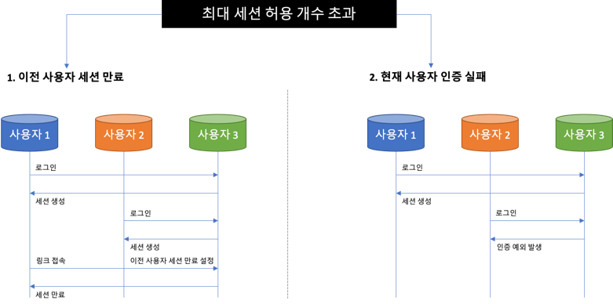
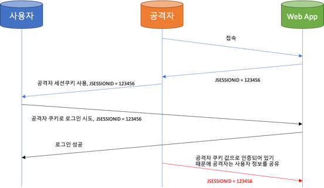
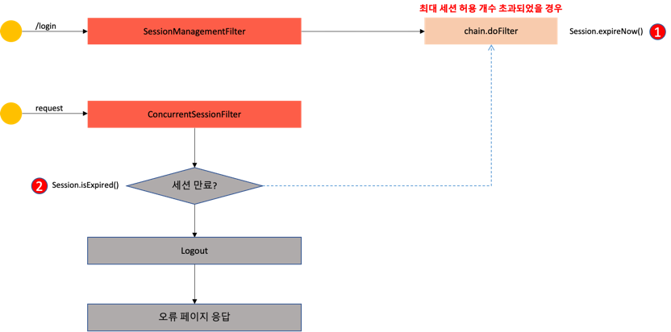
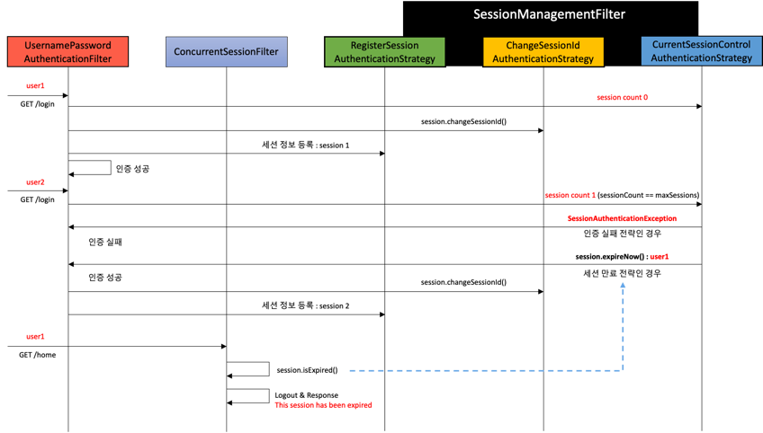

# Spring Security #1 - Spring Security 기본 API 및 Filter 이해 (3)

## 환경

- `java 11`
- `spring 2.7`
- `spring security 2.7`
- `spring data jpa 2.7`

## 동시 세션 제어, 세션 고정 보호, 세션 정책

### 동시 세션 제어

- 현재 동일한 계정으로 인증시 생성되는 세션의 허용 개수 초과시 어떻게 세션을 초과하지 않고 세션을 제어하는지
- 두 가지 전략을 제공



```java

@Configuration
@EnableWebSecurity
public class SecurityConfig {
    private UserDetailsService userDetailService;

    @Bean
    public SecurityFilterChain filterChain(HttpSecurity http) throws Exception {
        ...

        http.sessionManagement() // 세션 관리 기능 동작
                .maximumSessions(1) // 최대 허용 가능 세션 수 , -1 : 무제한 로그인
                .maxSessionsPreventsLogin(true) // 동시 로그인 차단(현재 사용자 인증 실패), false: 기존 세션 만료(default)
                .expiredUrl("/expired") // 세션이 만료된 경우 이동 할 페이지
        // 아래 옵션은 인강에서는 나오는데 spring 2.7에서는 안나옴...
//                .invalidSessionUrl("/invalid") // 세션이 유효하지 않을 때 이동 할 페이지
        ;
        
        ...
    }
}
```

### 세션 고정 보호



```java

@Configuration
@EnableWebSecurity
public class SecurityConfig {
    private UserDetailsService userDetailService;

    @Bean
    public SecurityFilterChain filterChain(HttpSecurity http) throws Exception {
        ...

        // 세션 고정 보호
        http.sessionManagement()
                .sessionFixation().changeSessionId()// 기본값,
        // none, migrateSession, newSession

        // migrateSession : 이전 세션에 설정한 속성값을 그대로 사용
        // newSession : 세션을 새로 발급하지만 이전에 설정한 속헝값을 사용 못함
        // none : 세션ID 가 바뀌지 않아 세션 고정 공격에 당하게 됨
        ;
        
        ...
    }
}
```

### 세션 정책

```java

@Configuration
@EnableWebSecurity
public class SecurityConfig {
    @Bean
    public SecurityFilterChain filterChain(HttpSecurity http) throws Exception {
        ...

        http.sessionManagement()
                .sessionCreationPolicy(SessionCreationPolicy.If_Required);
        
        ...
    }
}
```

| policy                            | description                    |
|-----------------------------------|--------------------------------|
| SessionCreationPolicy.Always      | 스프링 시큐리티가 항상 세션 생성             |
| SessionCreationPolicy.If_Required | 스프링 시큐리티가 필요 시 생성 (기본값)        |
| SessionCreationPolicy.Never       | 스프링 시큐리티가 생성하지 않지만 이미 존재하면 사용  |
| SessionCreationPolicy.Stateless   | 스프링 시큐리티가 생성하지 않고 존재해도 사용하지 않음 |

## 세션 제어 필터

### SessionManagementFilter



#### 1. 세션 관리

- 인증 시 사용자의 세션정보를 등록, 조회, 삭제 등의 세션 이력 관리

#### 2. 동시적 세션 제어

- 동일 계정으로 접속이 허용되는 초대 세션수 제한

#### 3. 세션 고정 보호

- 인증 할 때마다 세션쿠키를 새로 발급하여 공격자의 쿠키 조작을 방지

#### 4. 세션 생성 정책

- Always, If_Required, Never, Stateless

### ConcurrentSessionFilter

- 매 요청 마다 현재 사용자의 세션 만료 여부 체크
- 세션이 만료되었을 경우 즉시 만료 처리
- `session.isExpired() == true`
    - 로그아웃 처리
    - 즉시 오류 페이지 응답

### ConcurrentSessionFilter & SessionManagementFilter 정리

- `CuncurrentSessionFilter`와 `SessionManagementFilter`의 동작 워크플로우



#### UsernamePasswordAuthenticationFilter

- 인증을 처리하는 필터
- 인증 시도시 인증필더가 인증을 처리
- 다음으로 `ConcurrentSessionControlAuthenticationStrategy` 호출

#### ConcurrentSessionControlAuthenticationStrategy

- 동시적 세션 제어를 컨트롤하는 클래스
- 지금 인증 시도하는 계정의 세션 카운트를 체크
- 세션 정책에 따라 인증 실패 또는 세션 만료 처리를 진행

#### ChangeSessionIdAuthenticationStrategy

- 세션 고정 보호 처리 클래스
- 설정에 따라 새로운 세션 ID를 생성

#### RegisterSessionAuthenticationStrategy

- 사용자의 세션을 등록하고 재정하는 역할
- 해당 클래스가 처리가 되면 사용자 세션 정보가 저장되고 `session count = 1`로 처리되면 인증이 성공

#### ConcurrentSessionFilter

- 현재 세션 사용자의 만료 여부 체크
