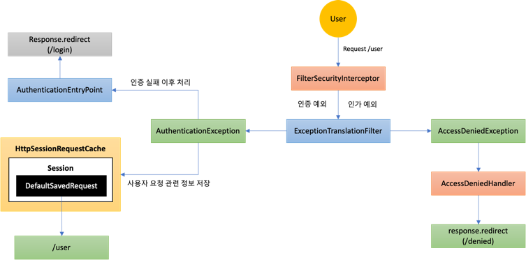
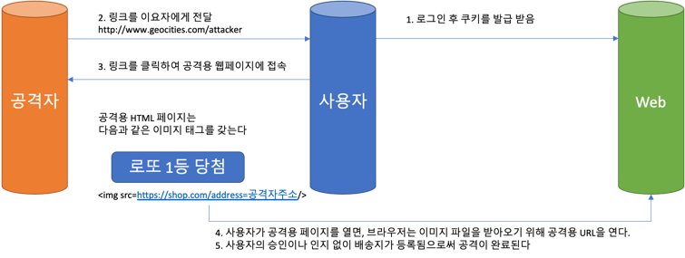

# Spring Security #1 - Spring Security 기본 API 및 Filter 이해 (4)

## 환경

- `java 11`
- `spring 2.7`
- `spring security 2.7`
- `spring data jpa 2.7`

## 인가 API

### 선언적 방식

#### Method, 동적 방식

```java
@PreAuthorize("hasRole('USER')")
public void user(){
        System.out.println("user");
        }
```

- 추후 실전예제에서 사용

#### URL

- Security Config

```java

@Configuration
@EnableWebSecurity
public class SecurityConfig {
    private UserDetailsService userDetailService;

    @Bean
    public SecurityFilterChain filterChain(HttpSecurity http) throws Exception {
        ...

        http.antMatcher("/shop/**")
                .authorizeRequests()
                // /shop/login, /shop/users/** 는 모두 허용(인증, 인가 처리 않음)
                .antMatchers("/shop/login", "/shop/users/**").permitAll()
                // /shop/mypage 는 USER 권한만 접근 가능
                .antMatchers("/shop/mypage").hasRole("USER")
                // /shop/admin/pay 는 ADMIN만 접근 가능
                .antMatchers("/shop/admin/pay").access("hasRole('ADMIN')")
                // /shop/admin/** 는 ADMIN과 SYS 만 접근 가능
                .antMatchers("/shop/admin/pay2").access("hasAnyRole('ADMIN', 'SYS')")
                // /shop/admin/** 는 ADMIN과 SYS 만 접근 가능
                .antMatchers("/shop/admin/**").access("hasRole('ADMIN') or hasRole('SYS')")
                // 다른 요청은 인증 필요
                .anyRequest().authenticated()
        ;

        ...
    }
}
```

- 주의사항 : 설정 시 구체적 경로가 먼저 오고 그것 보다 큰 범위의 경로가 뒤에 오도록 해야 함

### API 인가 표현식

| Method                  | 동작                                                   |
|-------------------------|------------------------------------------------------|
| authenticated()         | 인증된 사용자의 접근을 허용                                      |
| fullyAuthenticated()    | 인증된 사용자의 접근을 허용, RememberMe 인증 제외                    |
| permitAll()             | 무조건 접근을 허용                                           |
| denyAll()               | 무조건 접근을 허용하지 않음                                      |
| anonymous()             | 익명 사용자의 접근을 허용, 인증된 사용자는(USER) anonymous 권한에 접근이 불가능 |
| rememberMe()            | 기억하기를 통해 인증된 사용자의 접근을 허용                             |
| access(String)          | 주어진 SpEL 표현식의 평가 결과가 true 이면 접근을 허용                  |
| hasRole(String)         | 사용자가 주어진 역할이 있다면 접근을 허용 (ROLE_ prefix를 넣으면 안됨)       |
| hasAuthority(String)    | 사용자가 주어진 권한이 있다면 접근을 허용 (ROLE_ prefix를 넣어야 함)        |
| hasAnyRole(String)      | 사용자가 주어진 역할 중 어떤 것이라도 있다면 접근을 허용                     |
| hasAnyAuthority(String) | 사용자가 주어진 권한 중 어떤 것이라도 있다면 접근을 허용                     |
| hasIpAddress(String)    | 주어진 IP로부터 요청이 왔다면 접근을 허용                             |

### 사용자 생성(In Memory)

#### Spring Security 2.7 이전

- Security Config

```java

@Configuration
public class SecurityConfiguration extends WebSecurityConfigurerAdapter {

    @Override
    protected void configure(AuthenticationManagerBuilder auth) throws Exception {
        auth.inMemoryAuthentication().withUser("user").password("{noop}1111").roles("USER");
    }

    protected void configure(HttpSecurity http) throws Exception {

        http.authorizeRequests()
                .antMatchers("/users").hasRole("USER")
                .antMatchers("/admin/pay").hasRole("ADMIN")
                .antMatchers("/admin/**").hasAnyRole("ADMIN", "SYS")
                .anyRequest().authenticated();

        http.formLogin();
    }
}
```

#### Sprint Security 2.7 이후

- Security Config

```java

@Configuration
public class SecurityConfiguration extends WebSecurityConfigurerAdapter {

    @Bean
    public AuthenticationManager authenticationManager(AuthenticationManagerBuilder auth) throws Exception {


        // 메모리에 사용자 인증을 생성
        // 사용자 생성 개수는 재한이 없음
        // {noop} 패스워드 암호화시 특정 패스워드 암호화 방식을 적어줘야 한다, 패스워드 암호화가 이뤄지지 않음
        auth.inMemoryAuthentication().withUser("user").password("{noop}1111").roles("USER");
        auth.inMemoryAuthentication().withUser("sys").password("{noop}1111").roles("SYS");
        auth.inMemoryAuthentication().withUser("admin").password("{noop}1111").roles("ADMIN");

        return auth.build();
    }

    @Bean
    public SecurityFilterChain filterChain(HttpSecurity http) throws Exception {

        http.authorizeRequests()
                .antMatchers("/users").hasRole("USER")
                .antMatchers("/admin/pay").hasRole("ADMIN")
                .antMatchers("/admin/**").hasAnyRole("ADMIN", "SYS")
                .anyRequest().authenticated();

        http.formLogin();

        return http.build();
    }

}
```

- controller

```java

@RestController
public class SecurityController {
    @GetMapping("/users")
    public String users() {
        return "/users";
    }

    @GetMapping("/admin/pay")
    public String users() {
        return "/admin/pay";
    }

    @GetMapping("/admin/**")
    public String users() {
        return "/admin/**";
    }
}
```

## 예외 처리 및 요청 캐시 필터

### ExceptionTranslationFilter



- `Anonymous` 사용자와 `Remember Me`요청은 `AccessDeniedException`이 발생하면 `AccessDeniedHandler`로 가지 않고 인증 예외 처리과정으로 전달
- 인증 실패 이후 처리 전 `Security Context`의 인증객체를 `null`로 만드는 작업을 먼저 진행
- 이 필터는 크게 아래 두 가지 예외를 처리
- 아래 두 개는 `FilterSecurityInterceptor`에서 발생하면 `ExceptionTranslationFilter`로 `throw`

#### AuthenticationException

- 인증 예외 처리
    - `AuthenticationEntryPoint` 호출
    - 로그인 페이지 이동, 401 오류 코드 전달 등
- 인증 예외가 발생하기 전의 요청 정보 저장
    - `RequestCache` : 사용자의 이전 요청 정보를 **세션에 저장**하고 이를 꺼내오는 캐시 메커니즘
    - `SavedRequest` : 사용자가 요청했던 request 파라미터 값들, 그 당시의 헤더값들 등이 저장되는 구현체

#### AccessDeniedException

- 인가 예외 처리
    - `AccessDeniedHandler`에서 예외 처리하도록 제공

- Security Config

```java

@Configuration
public class SecurityConfiguration extends WebSecurityConfigurerAdapter {

    @Bean
    public AuthenticationManager authenticationManager(AuthenticationManagerBuilder auth) throws Exception {

        ...

        http.authorizeRequests()
                // 인증 실패시 로그인 페이지로 이동해야 하기 때문에 인증 받지 않은사용자의 접근을 위해 /login은 전체 허용
                .antMatchers("/login").permitAll();

        http.formLogin()
                .successHandler(new AuthenticationSuccessHandler() {
                    @Override
                    public void onAuthenticationSuccess(HttpServletRequest request, HttpServletResponse response, Authentication authentication) throws IOException, ServletException {
                        // 사용자가 원래 가고자 했던 정보
                        RequestCache requestCache = new HttpSessionRequestCache();
                        // 사용자가 가고자했던 요청 정보 저장
                        SavedRequest savedRequest = requestCache.getRequest(request, response);

                        // 원래 가고자 했던 요청 URL
                        String redirectUrl = savedRequest.getRedirectUrl();
                        response.sendRedirect(redirectUrl);
                    }
                })
        ;

        http.exceptionHandling() // 예외처리 기능이 작동
                // 인증 처리 실패 구현
                .authenticationEntryPoint(new AuthenticationEntryPoint() {
                    @Override
                    public void commence(HttpServletRequest request, HttpServletResponse response, AuthenticationException authException) throws IOException, ServletException {
                        // 우리가 만든 로그인 페이지로 이동
                        response.sendRedirect("/login");
                    }
                })
                // 인가 실패 처리 구현
                .accessDeniedHandler(new AccessDeniedHandler() {
                    @Override
                    public void handle(HttpServletRequest request, HttpServletResponse response, AccessDeniedException accessDeniedException) throws IOException, ServletException {
                        // 우리가 만든 denied 페이지로 이동
                        response.sendRedirect("/denied");
                    }
                });

        return auth.build();
    }


}
```

- controller

```java

@RestController
public class SecurityController {
    @GetMapping("/users")
    public String users() {
        return "/users";
    }

    @GetMapping("/login")
    public String users() {
        return "login";
    }

    @GetMapping("/denied")
    public String users() {
        return "denied";
    }
}
```

### RequestCacheAwareFilter

- `RequestCache`와 `SavedRequest`가 존재하면 객체를 얻어와 다음 필터로 전달 하는 역할을 함
    - 정확히는 `SavedRequest` 객체

## CSRF(사이트 간 요청 위조)



### CsrfFilter

- 모든 요청에 랜덤하게 생성된 토큰을 HTTP 파라미터로 요구
- 요청 시 전달되는 토큰 값과 서버에 저장된 실제 값과 비교한 후 만약 일치하지 않으면 요청은 실패

#### Client

```html
<input type="" hidden" name="${_csrf.parameterName}" value="${_csrf.token}" />
```

- Method : `PATCH`, `POST`, `PUT`, `DELETE`

#### Spring Security
```java

http.csrf() // 기본 활성화 되어 있음
http.csrf().disabled() // 비활성화

```

