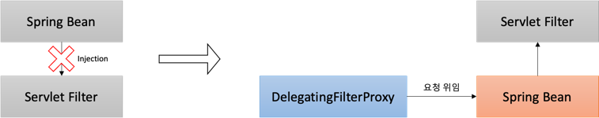
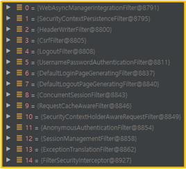
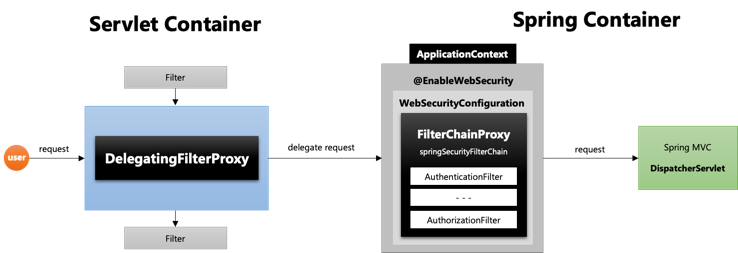
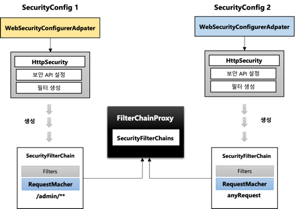
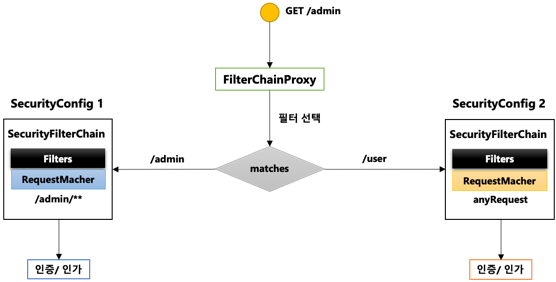

# Spring Security #2 - Spring Security 주요 아키텍처 이해 (1)

## 환경

- `java 11`
- `spring 2.7`
- `spring security 2.7`
- `spring data jpa 2.7`

## DelegatingFilterProxy



1. 서블릿 필터는 스프링에서 정의된 빈을 주입해서 사용할 수 없음
2. 특정한 이름을 가진 스프링 빈을 찾아 그 빈에게 요청을 위임하는 역할을 함
    - `springSecurityFilterChain` 이름으로 생성된 빈을 `ApplicationContext` 에서 찾아 요청을 위임
    - 실제 보안처리를 하지 않음

## FilterChainProxy



1. `springSecurityFilterChain`의 이름으로 생성되는 필터 `Bean`
2. `DelegatingFilterProxy`로 부터 요청을 위임 받고 실제 보안 처리
3. 스프링 시큐리티 초기화시 생성되는 필터들을 관리하고 제어
    - 스프링 시큐리티가 기본적으로 생성하는 필터
    - 설정 클래스에서 API 추가 시 생성되는 필터
    - 이전에 정리했던 필터들을 관리
4. 사용자의 요청을 필터 순서대로 호출하여 전달
5. 사용자정의 필터를 생성해서 기존 필터 전 후로 추가 가능
    - 필터의 순서를 잘 정의해야 함
6. 마지막 필터까지 인증 및 인가 예외가 발생하지 않으면 보안 통과

## DelegatingFilterProxy 와 FilterChainProxy 흐름 구성



## 필터 초기화와 다중 보안 설정



- 설정클래스 별로 보안 기능이 각각 작동
- 설정클래스 별로 `RequestMatcher` 설정
    - `http.antMatcher("/admin/**")`
- 설정클래스 별로 필터가 생성
- `FilterChainProxy`가 각 필터들을 가지고 있음
    - 우리가 설정한 `Filters`와 `RequestMatcher`가 저장된 `SecurityFilterChain`객체가 생성되고 `FilterChainProxy`에
      있는 `SecurityFilterChains`에 저장
    - `FilterChainProxy`에서 `SecurityFilterChain`에 저장된 `Filters`를 가져와서 필터를 실행
- 요청에 따라 `RequestMatcher`와 매칭되는 필터가 작동하도록 함

### SecurityFilterChain과 FilterChainProxy의 동작



- 아래 샘플 코드는 `/admin` URL로 접근하는 모든 요청은 인증을 받아야 하며 그 외 인증은 전부 허용하는 `SecurityFilterChain`들을 제공

```java

@Configuration
@EnableWebSecurity
// 등록된 SecurityFilterChain Bean에 우선순위를 지정
@Order(0)
// 첫번째 설정 클래스
public class SecurityConfigSample {
    @Bean
    public SecurityFilterChain sampleFilterChain1(HttpSecurity http) throws Exception {
        http
                // 모든 사용자가 인증을 받아야 /admin URL에 접근 가능한 httpBasic 인증
                .antMatcher("/admin/**")
                .authorizeRequests()
                .anyRequest().authenticated();

        http.httpBasic();

        return http.build();
    }
}

@Configuration
@EnableWebSecurity
@Order(1)
class SecurityConfigSample2 {
    @Bean
    public SecurityFilterChain sampleFilterChain2(HttpSecurity http) throws Exception {
        // 어떠한 요청에도 접근 가능
        http
                .authorizeRequests()
                .anyRequest().permitAll()
                .and()
                .formLogin();

        return http.build();
    }
}
```