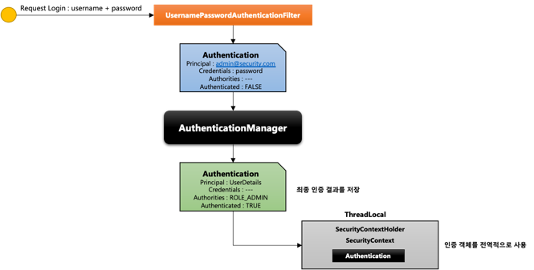
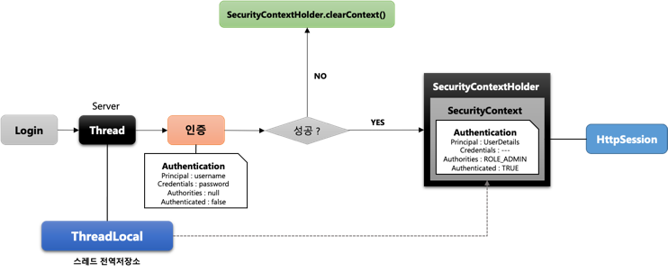
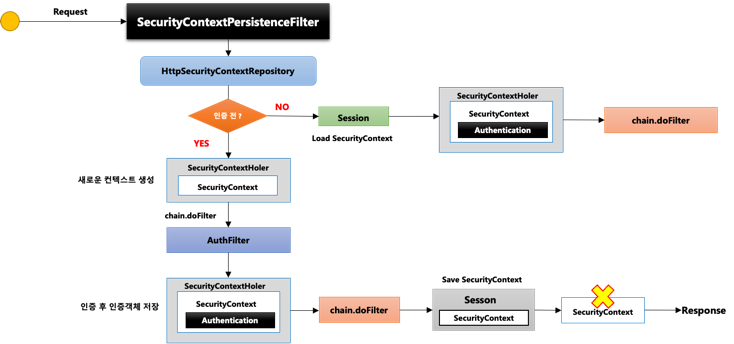
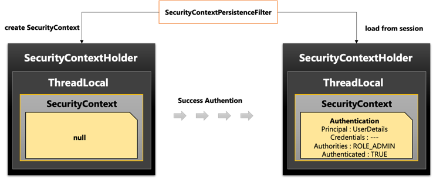
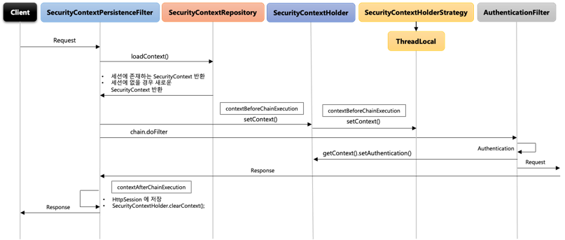

# Spring Security #2 - Spring Security 주요 아키텍처 이해 (2)

## 환경

- `java 11`
- `spring 2.7`
- `spring security 2.7`
- `spring data jpa 2.7`

## Authentication

- 당신이 누구인지 증명하는 것
- 사용자의 인증 정보를 저장하는 토큰 개념
- 인증 시 `ID` 와 `Password`를 담고 인증 검증을 위해 전달되어 사용
- 인증 후 최종 인증 결과를 담고 `SecurityContext`에 저장되어 전역적으로 참조가 가능

```java
Authentication authentication=SecurityContextHolder.getContext().getAuthentication();
```

- 구조

| 항목            | 설명                 |
|---------------|--------------------|
| principal     | 사용자 혹은 User 객체를 저장 |
| credentials   | 사용자 비밀번호           |
| authorities   | 인증된 사용자의 권한 목록     |
| details       | 인증 부가 정보           |
| Authenticated | 인증 여부              |



- 사용자가 사용자 인증 정보를 입력해서 요청
- `UsernamePasswordAuthenticationFilter` 에서 `Authentication`객체를 생성
- `AuthenticationManager`에서 인증 객체를 가지고 인증을 총괄
    - 인증 실패면 인증 예외 처리
    - 인증 성공하면 인증 처리 전에 생성했던 동일한 객체를 생성
    - `Credentials`는 보안성 비워둠
    - `Authorities`에 권한을 넣저장
    - `Authenticated`가 `TRUE`로 저장
- `SecurityContextHolder.SecurityContext`에 `Authentication`객체 저장
    - 인증 객체를 전역적으로 사용 가능

## SecurityContext

- `Authentication` 객체가 저장되는 보관소로 필요시 언제든 인증 객체를 꺼내어 쓸 수 있도록 제공되는 클래스
- `ThreadLocal`에 저장되어 아무곳에서나 참조가 가능하도록 설계
- 인증이 완료되면 `HttpSession`에 저장되어 어플리케이션 전반에 걸쳐 전역적인 참조가 가능

## SecurityContextHolder

- SecurityContext 객체 저장 방식

| Value                       | 설명                                           |
|-----------------------------|----------------------------------------------|
| MODE_THREADLOCAL            | 스레드당 `SecurityContext`객체를 할당, 기본값            |
| MODE_INHERITABLETHREADLOCAL | 메인 스레드와 자식 스레드에 관하여 동일한 `SecurityContext` 유지 |
| MODE_GLOBAL                 | 응용 프로그램에서 단 하나의 `SecurityContext`를 저장        |

## SecurityContext와 SecurityContextHolder의 흐름



- 사용자가 로그인 시도 하면 서버에서는 하나의 스레드 생성
    - `ThreadLocal` 스레드 전역 저장소에 저장
- 사용자의 로그인 정보를 이용해 인증을 시도
    - 인증이 실패하면 `SecurityContextHolder.createContext()`를 이용하여 `SecurityContextHolder` 초기화
    - 인증이 성공하면 `SecurityContextHolder.SecurityContext`에 인증에 성공한 `Authentication`객체를 저장
- `SecurityContextHolder`에서 `ThreadLocal`을 갖고 있고 `ThreadLocal`에 `SecurityContext`를 담고 있음
- 최종적으로 `SecurityContext`가 `HttpContext`에 `SPRING_SECURITY_CONTEXT`로 저장 됨
- 인증된 사용자가 인증 이후에 사이트 접속시 `Session`에 저장된 `SecurityContext`를 가져와서 다시 `ThreadLocal`에 저장

```java

@RestController
public class SecurityController {

    @GetMapping("/")
    public String index(HttpSession httpSession) {

        Authentication authentication = SecurityContextHolder.getContext().getAuthentication();
        SecurityContext context
                = (SecurityContext) httpSession.getAttribute(HttpSessionSecurityContextRepository.SPRING_SECURITY_CONTEXT_KEY);
        Authentication authentication1 = context.getAuthentication();

        return "home";
    }

    @GetMapping("/thread")
    public String thread() {
        new Thread(new Runnable() {
            @Override
            public void run() {
                Authentication authentication = SecurityContextHolder.getContext().getAuthentication();
            }
        }).start();

        return "thread";
    }
}
```

- `/`요청시 가져온 `authentication`과 `authentication1`은 동일한 객체이다
- `/thread` 요청시 가져온 객체는 없다
    - 메인 `ThreadLocal`에 담은거지 자식 `ThreadLocal`에 담지 않았기 떄문에

```java
SecurityContextHolder.setStrategyName(SecurityContextHolder.MODE_INHERITABLETHREADLOCAL);
```

- 위 코드를 이용해서 모드를 변경 할 수 있다(모드에 상세 내용은 위에 표 확인)

## SecurityContextPersistenceFilter



- SecurityContext 객체의 생성, 저장, 조회
- 익명 사용자
    - 새로운 `SecurityContext`객체를 생성하여 `SecurityContextHolder`에 저장
    - `AnonymousAuthenticationFilter`에서 `AnonymousAuthenticationToken`객체를 `SecurityContext`에 저장
- 인증시
    - 새로운 `SecurityContext`객체를 생성하여 `SecurityContextHolder`에 저장
    - `UsernamePasswordAuthenticationFilter`에서 인증 성공 후 `SecurityContext`에 `UserPasswordAuthentication`객체를 저장
    - 인증이 최종 완료되면 `Session`에 `SecurityContext`를 저장
- 인증후
    - `Session`에서 `SecurityContext`를 꺼내어 `SecurityContextHolder`에서 저장
    - `SecurityContext`안에 `Authentication`객체가 존재하면 계속 인증을 유지
- 최종 응답시 공통
    - `SecurityContextHolder.clearContext()`

- 실제로 `HttpSecurityContextRepository`가 `SecurityContext` 객체를 생성하고 조회



