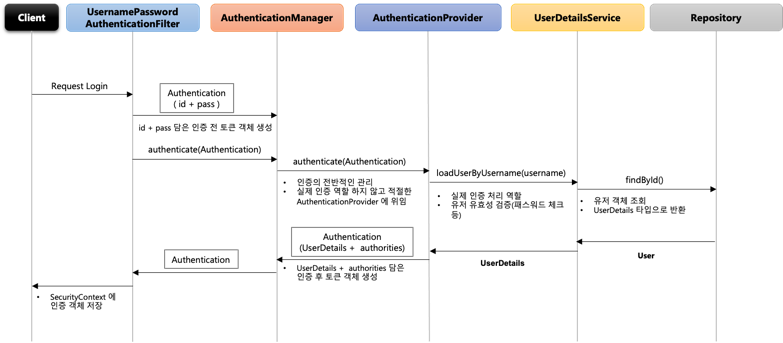
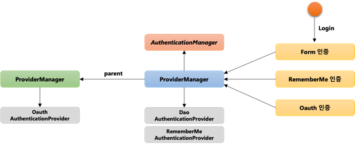

# Spring Security #2 - Spring Security 주요 아키텍처 이해 (3)

## 환경

- `java 11`
- `spring 2.7`
- `spring security 2.7`
- `spring data jpa 2.7`

## Authentication Flow

- 인증을 처리하는 전반적인 flow 확인

- 사용자가 인증 요청
- `UsernamePasswordAuthenticationFilter`(Form 인증 방식)에서 ID와 Password를 담은 `Authentication` 인증 객체를 생성
- `AuthenticationManger`에 인증처리를 위임 하면서 생성한 `Authentication` 객체를 전달
  - `AuthenticationManger`에서 인증의 전반적인 관리가 됨
  - 실제 인증 역할을 하지하고 적절한 `AuthenticationProvider`에 위임
- `AuthenticationProvider`에서 `AuthenticationManager`에서 전달 받은 객체로 ID와 Password를 검증
- `UserDetailsService.loadUserByUsername(username)`을 호출 하면서 `User` 객체 정보를 요청
  - 실제 인증 처리 역할을 하며 유저의 유효성(패스워드 등) 검증
- `Repository`에서 유저 정보를 조회 한다음 `UserDetails` 타입으로 반환하며, `UserDetailsService`에서 검증 작업 수행
- `UserDetails` 객체를 `AuthenticationProvider`에 전달해서 `UserDetails`와 `authorities` 객체를 담은 인증 토큰 객체 생성해서 `AuthenticationManager`에 전달
- `AuthenticationManager`는 전달 받은 인증 객체를 다시 `UsernamePasswordAuthenticationFilter`에 전달하고 `SecurityContext`에 저장

## AuthenticationManager

- `Filter`로 부터 처음 인증처리를 위임받는 인터페이스
- `ProviderManager`를 관리하는 클래스
- `AuthenticationProvider`목록 중에서 인증 처리 요건에 맞는 `Provider`를 찾아 인증처리를 위임
- 부모 `ProviderManager`를 설정하여 `AuthenticationProvider`를 계속 탐색 가능

- `AuthenticationProvider`를 선택하는 기준은 현재 선택된 인증 방식에 따라 결정 됨