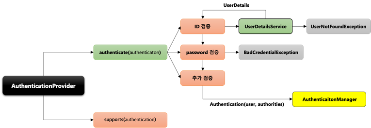
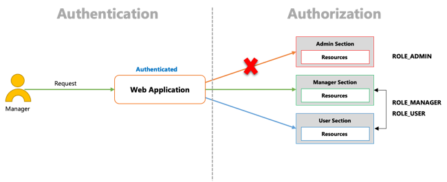
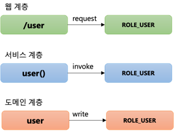
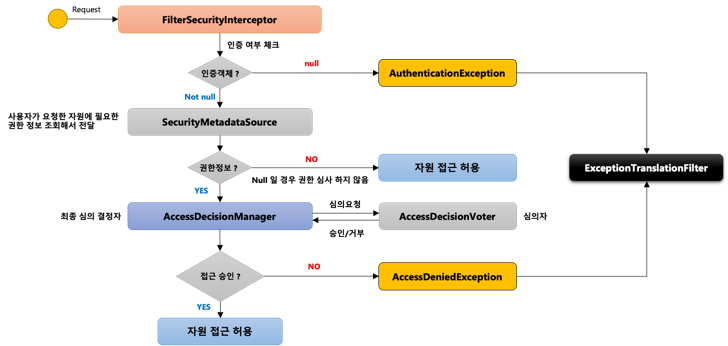
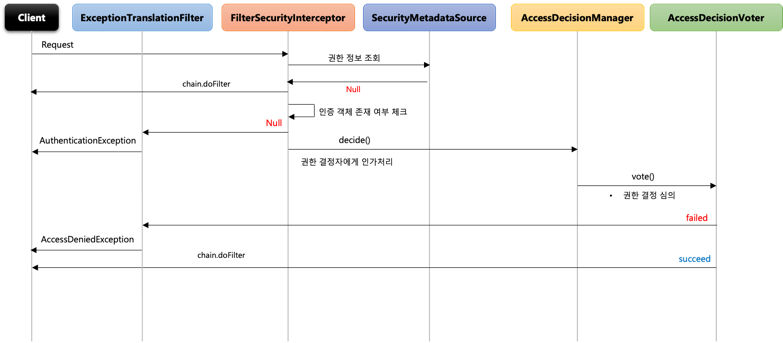
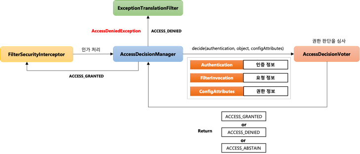
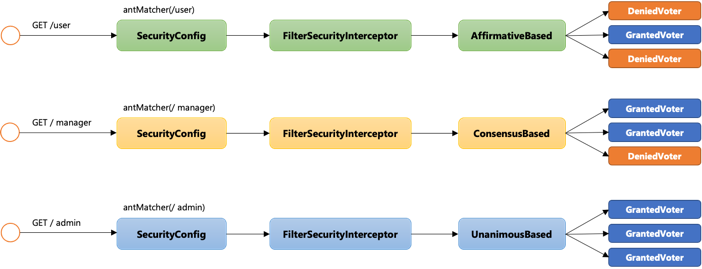
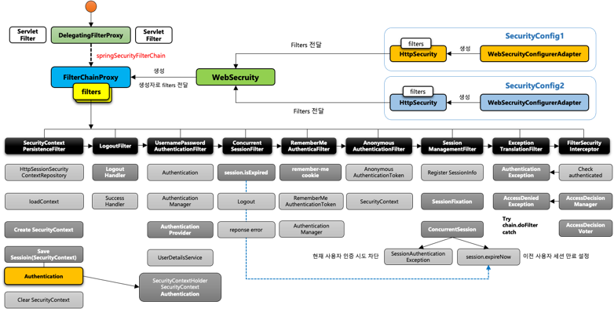

# Spring Security #2 - Spring Security 주요 아키텍처 이해 (3)

## 환경

- `java 11`
- `spring 2.7`
- `spring security 2.7`
- `spring data jpa 2.7`

## Authentication Flow

- 인증을 처리하는 전반적인 flow 확인

- 사용자가 인증 요청
- `UsernamePasswordAuthenticationFilter`(Form 인증 방식)에서 ID와 Password를 담은 `Authentication` 인증 객체를 생성
- `AuthenticationManger`에 인증처리를 위임 하면서 생성한 `Authentication` 객체를 전달
    - `AuthenticationManger`에서 인증의 전반적인 관리가 됨
    - 실제 인증 역할을 하지하고 적절한 `AuthenticationProvider`에 위임
- `AuthenticationProvider`에서 `AuthenticationManager`에서 전달 받은 객체로 ID와 Password를 검증
- `UserDetailsService.loadUserByUsername(username)`을 호출 하면서 `User` 객체 정보를 요청
    - 실제 인증 처리 역할을 하며 유저의 유효성(패스워드 등) 검증
- `Repository`에서 유저 정보를 조회 한다음 `UserDetails` 타입으로 반환하며, `UserDetailsService`에서 검증 작업 수행
- `UserDetails` 객체를 `AuthenticationProvider`에 전달해서 `UserDetails`와 `authorities` 객체를 담은 인증 토큰 객체
  생성해서 `AuthenticationManager`에 전달
- `AuthenticationManager`는 전달 받은 인증 객체를 다시 `UsernamePasswordAuthenticationFilter`에 전달하고 `SecurityContext`에 저장

## AuthenticationManager

- `Filter`로 부터 처음 인증처리를 위임받는 인터페이스
- `ProviderManager`를 관리하는 클래스
- `AuthenticationProvider`목록 중에서 인증 처리 요건에 맞는 `Provider`를 찾아 인증처리를 위임
- 부모 `ProviderManager`를 설정하여 `AuthenticationProvider`를 계속 탐색 가능

- `AuthenticationProvider`를 선택하는 기준은 현재 선택된 인증 방식에 따라 결정 됨

## AuthenticationProvider

- `AuthenticationManager`로부터 인증 객체를 전달 받아 실질적으로 인증 처리를 하는 인터페이스
- 인증에 성공하게 되면 인증에 성공한 인증 객체를 `AuthenticationManager`로 전달
- `authenticate(authentication)`에서 인증을 실시
- `supports(authentication)`에서 `rememberMe`인증과 현재의 `form 인증`을 처리하는 기준이 되는지를 검사

## Authorization

- `Spring Security`는 `Authentication`과 `Authorization` 두 영역으로 분리하여 처리
- 인가는 `Authorization` 영역에서 처리 됨
    - 인가 : 당신에게 무엇이 허가 되어있는지 증명 하는 것
    - 사용자가 인증 여부를 판단받은 후 해당 자원에 접근 자격이 있는지 권한 심사를 하는것

### Spring Security 가 지원하는 권한 계층

- 웹 계층
    - URL 요청에 따른 메뉴 혹은 화면단위의 레벨 보안
- 서비스 계층
    - 화면단위가 아닌 메소드 같은 기능 단위의 레벨 보안
- 도메인 계층(Access Control List, 접근제어목록)
    - 객체 단위의 레벨 보안

## FilterSecurityInterceptor

- 마지막에 위치한 필터로써 인증된 사용자에 대하여 특정 요청의 승인/거부 여부를 최종적으로 결정
- 인증객체 없이 보호자원에 접근을 시도할 경우 `AuthenticationException` 발생
- 인증 후 자원에 접근 가능한 권한이 존재하지 않을 경우 `AccessDeniedException` 발생
- 권한 제어 방식 중 HTTP 자원의 보안을 처리하는 필터
- 실제 권한 처리를 `AccessDcisionManager`에게 위임

- 사용자자 요청
- `FilterSecurityInterceptor`에서 인증 여부를 체크
    - 인증 객체가 없으면 `AuthenticationException` 발생
        - `ExceptionTranlationFilter`에서 전달 받아 Login page 이동 등 후속작업 진행
    - 인증 객체가 존재하면 `SecurityMetadataSource`에서 다음과 같은 처리 진행
        - 요청 정보에서 자원의 정보를 가저옴
        - 대상 자원에 접근에 필요한 권한 정보가 있는지 조회
        - 권한 정보가 없으면 자원에 접근 허용
        - 권한 정보가 있으면 `AccessDecisionManager`(최종 심의 결정자)에게 권한 정보 전달
- `AccessDecisionManager`에서 내부적으로 `AccessDecisionVoter`에 심의를 요청
    - 접근 승인이 되지 않으면 `AccessDeniedException`발생
        - `ExceptionTranlationFilter`에서 전달 받아 Login page 이동 등 후속작업 진행
    - 접근 승인되면 자원에 접근 하용

## AccessDecisionManager

- 인증정보, 요청정보, 권한정보를 이용해서 사용자의 자원접근을 허용할 것인지 거부할 것인지를 최종 결정하는 주체
- 여러 개의 `Voter`들을 가질 수있으며 `Voter`들로 부터 접근허용, 거부, 보류에 해당하는 각각의 값을 리턴받고 판단 및 결정
- 최종 접근 거부시 예외 발생

### 접근결정의 세가지 유형

- AffirmativeBased
    - 여러개의 `Voter`클래스 중 하나라도 접근 허라고 결론을 내면 접근 허라고 판단
- ConsensusBased
    - 다수표(승인 및 거부)에 의해 최종 결정을 판단
    - 동수일 경우 기본은 접근 허가이나 `allowIfEqualGrantedDeniedDesisions`를 false 로 설정할 경우 접근거부로 결정
- UnanimousBased
    - 모든 `Voter`가 만장일치로 접근을 승인해야 하며 그렇지 않은 경우 접근을 거부

## AccessDecisionVoter

- 판단을 심사하는 것(심의자)
- `Voter`가 권한 부여 과정에서 판단하는 자료

| 판단 기준            | 설명                         |
|------------------|----------------------------|
| Authentication   | 인증 정보(USER)                |
| FilterInvocation | 요청 정보(antMatcher("/user")) |
| ConfigAttributes | 권한 정보(hasRole("User"))     |

- 결정 방식

| 결정 방식          | 설명        |
|----------------|-----------|
| ACCESS_GRANTED | 접근 허용(1)  |
| ACCESS_DENIED  | 접근 거부(0)  |
| ACCESS_ABSTAIN | 접근 보류(-1) |

- 접근 보류는 `Voter`가 해당 타입의 요청에 대한 결정을 내릴 수 없는 경우

### Workflow

## Spring Security Filter 및 Architecture 정리

- 아래 사진의 위쪽은 `Spring Security`초기화 과정과 아래쪽의 `Filter`들의 처리 과정들에 대한 구성

### 정리 - Spring Security 초기화

- `SecurityConfig` 설정 클래스를 만들어 `API` 정의
    - `API` 들이 각각의 요청을 받아 처리하도록 구성
- `Security`가 초기화 될때 설정한 `API`와 `구성`대로 Filter 생성
    - `HttpSecurity`에서 `Filter 생성
- 생성된 `Filter`들은 `WebSecurity` 클래스로 전달
- `WebSecurity`는 `FilterChainProxy`의 `Bean` 객체를 생성
    - 생성자로 `filters` 전달
- `FilterChainProxy`가 `Filters`를 가지고 있음
- `DelegatingFilterProxy`는 `ServletFilter`로 초기화될 때 `FilterChainProxy`가 `Bean`으로 등록되어있는 상태
    - 특정 이름을 갖는 `Bean`클래스를 찾음(`springSecurityFilterChain` == `FilterChainProxy`)
    - 사용자가 요청시 자신이 요청을 처리하지 않고 `FilterChainProxy`에게 처리를 위임
