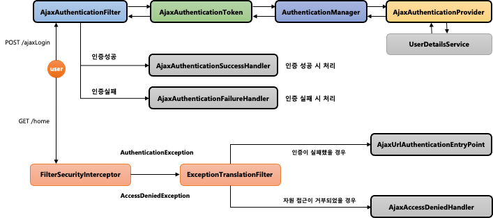

# Spring Security #3 - Ajax 인증 (1)

## 환경

- `java 11`
- `spring 2.7`
- `spring security 2.7`
- `spring data jpa 2.7`

## Ajax 인증

### 흐름 및 개요



- Ajax 용 `Filter`, `Token`, `Provider`등을 구현 하지만 실제 동작 로직은 `Form Login`방식과 비슷

## AjaxAuthenticationFilter

- `AbstractAuthenticationProcessingFilter` 상속
- 필터의 작동 조건
    - `AntPathRequestMatcher("/api/login")`로 요청 정보와 매칭하고 요청 방식이 Ajax 이면 필터 작동
- `AjaxAuthenticationToken`을 생성하여 `AuthenticationManager`에게 전달하여 인증 처리
- `Filter` 추가

```java
http.addFilterBefore(AjaxAuthenticationFilter(),UsernamePasswordAuthenticationFilter.class);
```

## AjaxAuthenticationProvider

## AjaxAuthenticationSuccessHandler

## AjaxAuthenticationFailureHandler

